Mains Power Controller
----

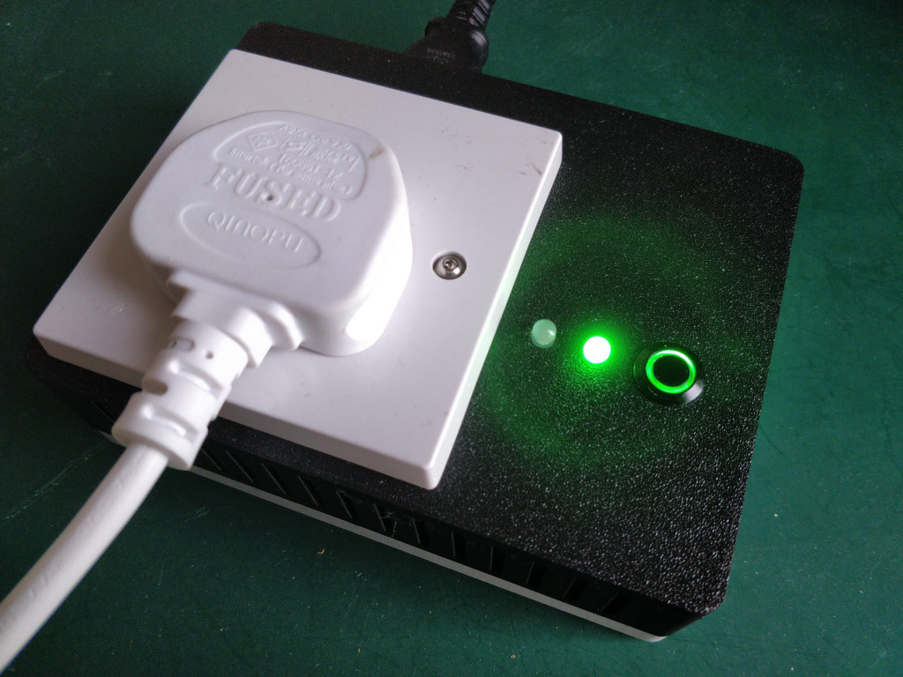

*Mains Power Controller*

----

## Warning!

Mains electricity can kill you. If you don't know what you are doing, don't do it.
This project involves live mains power.

----

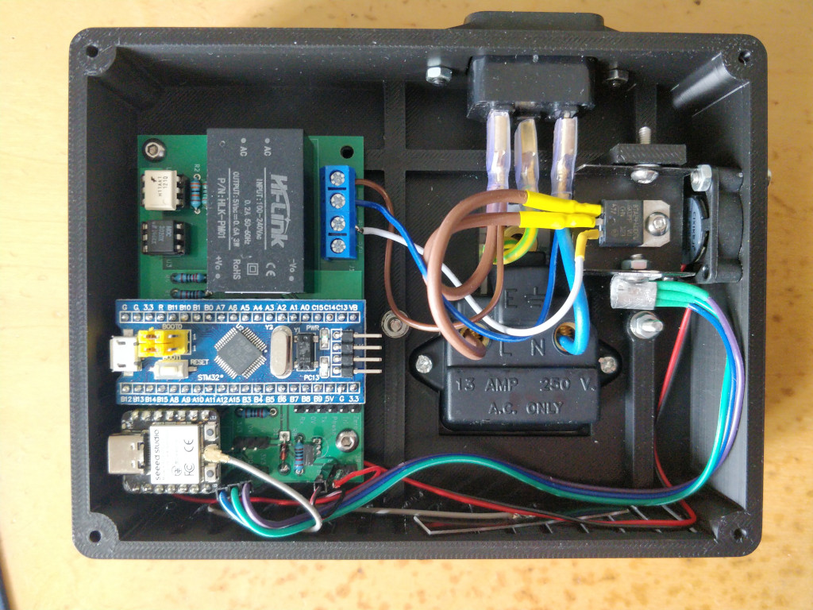

*Mains Power Controller interior*

I wanted a way to divert excess power from my solar panels into a load,
so I can use just excess solar power.
For example, to run an electric heater or a kettle.
This allows me to run an applicance at zero cost.

This project is based on an earlier one
[earlier one](https://www.rotwang.co.uk/projects/kettle.html)
and uses similar technology.
I designed a smart meter that sends out 
[MQTT](https://en.wikipedia.org/wiki/MQTT)
messages every second showing the total power import / export for my home/.
Using these messages I can apply power to a load that uses any excess solar power.

The design is simple : detect the zero-crossing point of the mains power waveform.
Turn on a [TRIAC](https://en.wikipedia.org/wiki/TRIAC),
controlling the phase to adjust the power applied to a load.

The [H11AA4](docs/H11AA1M.pdf) optocoupler is ideal for zero-crossing detection.
It has two back to back LEDs and a photo transistor. 
It provides Galvanic isolation, to separate the microcontroller from the mains power.
It just needs a single series resistor to set the max LED current.

The output circuit uses an opto-TRIAC [MOC3020](docs/MOC3020.pdf)
connected to a power TRAIC, the [BTA24](BTA24.pdf).
The opto device provides Galvanic isolation, the power TRIAC does the heavy lifting.

I use the ESP32 for lots of my projects and wanted to use it here, as it has
a built in WiFi module and supports MQTT.
However, my first attempt ran into a few problems.
I needed two things : a 
[Schmitt trigger](https://en.wikipedia.org/wiki/Schmitt_trigger)
input and a way to chain timer events to input and output signals.
It turned out that the ESP32C3 failed at both of these simple things.
The GPIOs do not have Schmitt inputs. I was surprised at this.
Secondly, the timers do not have event chaining.
I wanted the timing to be fully automatic so this ruled out the ESP32C3.
But I still wanted the WiFi support.

Without a Schmitt trigger the slow analog input signal causes spikes and multiple triggers like this :

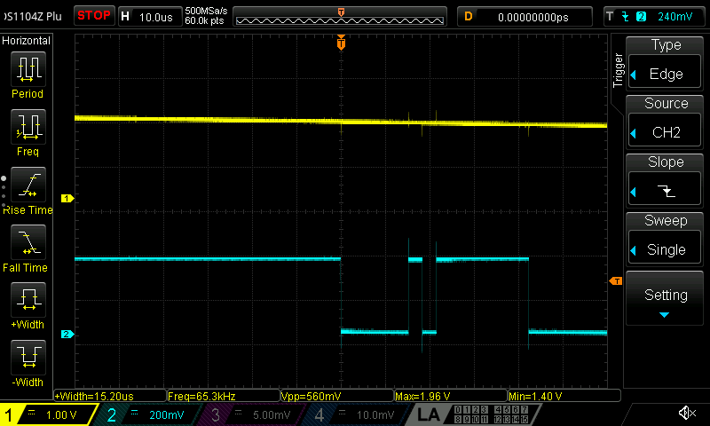

*multiple triggering seen when an analog input meets a GPIO with no Schmitt trigger*

So I ended up with a hybrid solution. Not a great one, but a compromise.
I used 2 microcontrollers - one to provide the zero crossing detection and phase control,
the second to drive the control system and MQTT interface.
I settled on an STM32F1 as they are cheap, simple and I had one to hand.
If I were to start on new hardware I'd probably use one of the smaller footprint devices,
but the STM32F1 is fine.

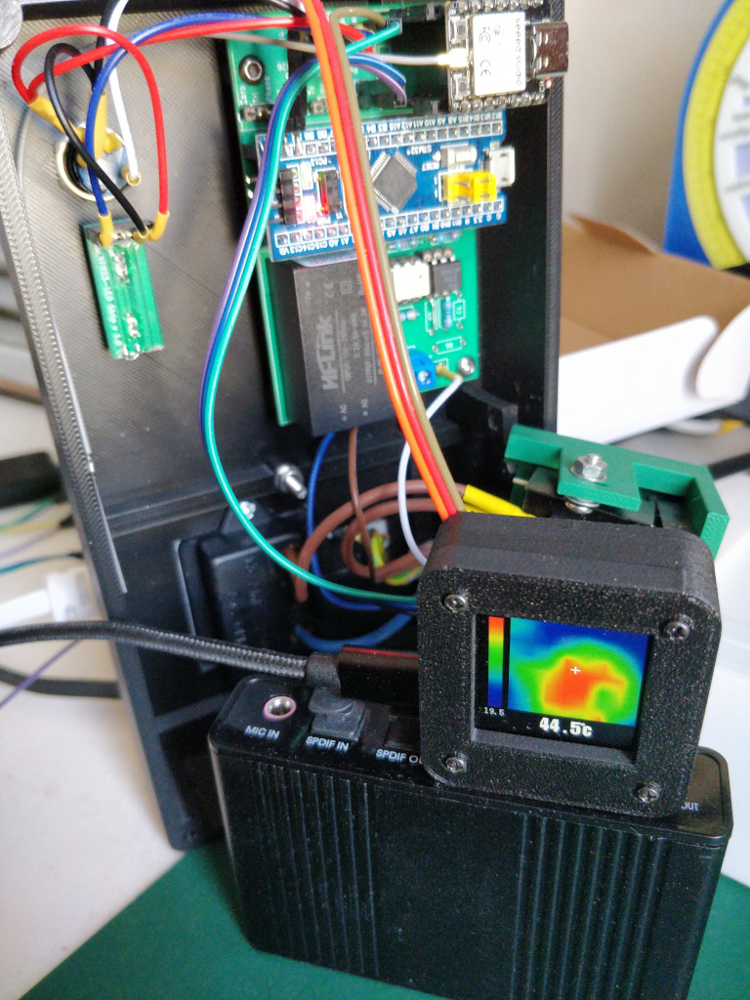

*Using a thermal camera to check the temperature on the first prototype*

This fan was too small to cool the heatsink adequately.
I used a larger fan for the final design.

----

## STM32 ARM Controller

I write my embedded code using my [Panglos][Panglos] framework.
This allows me to develop target agnostic code and to reuse all my drivers and library code.
The STM32 code was very simple. I didn't need any OS support, 
so I could use Panglos directly as a bare metal system.
All it needed was UART support for communication with the ESP32,
GPIOs and some timer code.
I added simple GPIO and UART support to Panglos for the STM32F1 using direct control-register access.
I don't event need the HAL code.

The 
[STM32 code](https://github.com/DaveBerkeley/mains-power-control/tree/master/stm32)
is on github.

The timer code was developed using interaction with [Claude AI](https://claude.ai/).
I'm interested in how AI can help write code, so I thought I'd experiment.
The timer code is a one-off, I don't want to write a portable library (unlike the UART and GPIO code). 
I just needed help chaining the GPIO and timers together.
It was interesting, requiring multiple iterations with Claude.
I was testing the code on real hardware.
I fed a low voltage sinewave into the opto detector as a signal source,
viewing the outputs on a 'scope.
I have a number of reservations about the use of AI in software. I think that we need to be careful.
But this was an experiment.

The sinewave generator I used for this test was FPGA based on my
[CORDIC](https://github.com/DaveBerkeley/cordic) library
and my 
[Streams](https://github.com/DaveBerkeley/streams) library
together to drive an I2S output with sine data into a PMOD DAC.
FPGAs are very handy for generating test signals.

The result used 3 timers : one to trigger on the input from the zero-crossing detector.
This allows me to measure the period of the mains cycle.
The second timer provides the phase offset. This is a one-shot timer triggered by the first timer.
The period can be adjusted to control the phase of the output TRIAC.
This in turn triggers a third timer. This is another one-shot that provides the trigger pulse to the TRIAC.
Once configured the timers run independently of the CPU.
All you have to do is set the second timer's period to control the phase of the TRIAC and
therefore the power applied to the load.

The top trace is the analog output of the zero-crossing detector.
The input signal is a lower voltage for test purposes. In the real circuit the "on" periods will be shorter.
The second trace is the output of the second timer, showing the adjustable phase period.
The third trace is the TRAIC drive signal.

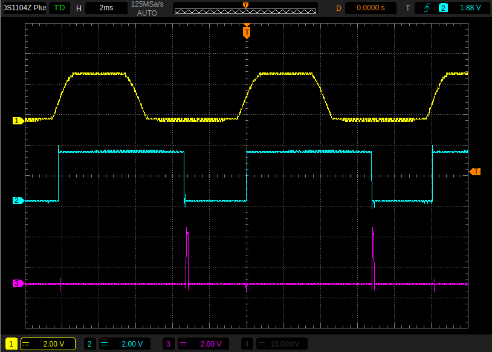

*STM32 timer input and output signals*

For development I added a CLI to the STM32 using my [CLI library][CLI library].
This allowed me to interact with the STM32, set the TRIAC phase, see the timing etc.
I was going to add a serial protocol for the ESP32 to talk to the STM32, but in the end
I just went with the CLI. It was already there and easy to use.

The device initialisation is data driven.  The STM32F1 is a relatively simple device. 
Each IO pin can have an ALT purpose, so the function is tied to a specific pin.
In the ESP32 you can assign any pin to be connected to any peripheral.
The config code simply sets the ALT function for GPIOs that are intialised eleswhere
by their drivers.

    #define DEBUG_UART (USART1)
    #define COMMS_UART (USART2)

    GPIO *led;

    typedef STM32F1_GPIO::IO IODEF;

    typedef struct {
        GPIO_TypeDef *port;
        uint32_t pin;
        IODEF io;
        GPIO **gpio;
    } IoDef;

    static const IODEF ALT_IN  = IODEF(IODEF::INPUT  | IODEF::ALT);
    static const IODEF ALT_OUT = IODEF(IODEF::OUTPUT | IODEF::ALT);

    static const IoDef gpios[] = {
        {   GPIOC, 13, IODEF::OUTPUT, & led, }, // LED
        {   GPIOA, 9,  ALT_OUT, }, // UART Tx
        {   GPIOA, 10, ALT_IN,  }, // UART Rx
        {   GPIOA, 2,  ALT_OUT, }, // Comms Tx
        {   GPIOA, 3,  ALT_IN,  }, // Comms Rx
        {   GPIOA, 0,  ALT_IN,  }, // TIM2 counter/timer input
        {   GPIOA, 6,  ALT_OUT, }, // TIM3 phase output
        {   GPIOB, 6,  ALT_OUT, }, // TIM4 triac output
        { 0 },
    };

    void init_gpio(const IoDef *gpios)
    {
        for (const IoDef *def = gpios; def->port; def++)
        {
            STM32F1_GPIO::IO io = def->io;
            if (!def->gpio) io = IODEF(io | IODEF::INIT_ONLY);
            GPIO *gpio = STM32F1_GPIO::create(def->port, def->pin, io);
            if (def->gpio) *def->gpio = gpio;
        }
    }

Once the target specific initialisation is done, the devices 
(with the exception of the timer code),
are all abstracted, so the code is OS and target agnostic.

----

## ESP32 RISC-V Controller

The main control system runs on the ESP32. I used an 
[ESP32C3 XIAO](https://wiki.seeedstudio.com/XIAO_ESP32C3_Getting_Started/)
from [Seeed Studio](https://www.seeedstudio.com/).
It uses my [Panglos][Panglos] framework on top of FreeRTOS.
The controller does the following :

* controls the STM32 via a UART
* provides a UI via a push button and 2 smart LEDs
* connects to the home WiFi
* subscribes to MQTT messages from my smart meter
* monitors the TRIAC temperature using a [DS18B20](docs/DS18B20.pdf) [OneWire](https://en.wikipedia.org/wiki/1-Wire) sensor.
* controls a cooling fan using a GPIO pin
* regulates the power applied to the load by controlling the TRIAC phase
* handles error situations : eg. loss of WiFi, overtemperature etc.
* runs a CLI over UART and network to allow configuration and remote control / monitoring

For the LEDs I used the [WS2812B](docs/WS2812B.pdf) smart LED.
I already had drivers for this device in [Panglos][Panglos] that wrap the ESPIDF RMT library.
I had to add a [OneWire driver](https://github.com/DaveBerkeley/panglos/blob/master/src/esp32/one_wire_bitbang.cpp).
There is a driver in ESPIDF that also uses the RMT device, but I was already using this for the LEDs.
So I had to use a bit-banged driver instead.
The [DS18B20 driver](https://github.com/DaveBerkeley/panglos/blob/master/src/drivers/ds18b20.cpp)
works with either OneWire driver.
It follows the [Panglos][Panglos] design philosophy of removing all hardware and OS dependency from the code.
It also abstracts the temperature sensor so that you can unit test the control code without the hardware.
This means that you can use tools like 
[valgrind](https://valgrind.org/) to check for leaks or memory errors, 
without needing to run on the target.
You can exhaustively test your code.

The temperature control code is very simple.
It simply turns on a fan when the temperature rises above a set point.
It turns the fan off when the teperature falls below a different set point.
It also proves an alarm() output for over-temperature.
As both the Temperature sensor and the GPIO used to control the fan are both abstracted, 
they are trivially simple to test.

The ESP32 also runs my [CLI library][CLI library]. This allows full control of the configuration of the system.
It also provides a number of test modes : for example you can simulate the device temperature to check the 
control systems are working.
The CLI is available over the USB/UART interface.
The ESP32 also runs a CLI server over the WiFi connection on port 6668, so you can telnet to the device remotely.
This makes test and monitoring very simple.
To monitor the device you can, for example, 
turn on 'verbose' mode for the app and log all debug output to the selected network CLI.

    > verbose app 1
    > log
    703220 main DEBUG src/mains_control.cpp +472 set_phase() : phase=0 percent=0 power=273 t=15
    703302 main DEBUG src/mains_control.cpp +472 set_phase() : phase=0 percent=0 power=271 t=15
    703404 main DEBUG src/mains_control.cpp +472 set_phase() : phase=0 percent=0 power=270 t=15
    703507 main DEBUG src/mains_control.cpp +472 set_phase() : phase=0 percent=0 power=270 t=15
    703609 main DEBUG src/mains_control.cpp +472 set_phase() : phase=0 percent=0 power=272 t=15

The net CLI code supports multiple clients, so you can log in on one term and tail the log in another :

    echo -e "log\n" | nc pwr1.local 6668 

The code supports [mDMS](https://en.wikipedia.org/wiki/Multicast_DNS) so you can configure the unit 
with a friendly name. In this case 'pwr1'.

The [ESP32 code](esp32) is in github. 
The main control code is in [esp32/src/mains_control.cpp](esp32/src/mains_control.cpp).

The device initialisation is more complex than the STM32 case. It uses panglos::init_devices(). 
This takes an array of Device descriptions
and initialises them in order, taking into account any device dependency.
In this case the ds18b20 temperature sensor needs the OneWire device to be 
created first.
By convention the Device array board_devs is used to specify all the devices.
The function board_init() is also called after the main system is up.

The board_init() function registers the network CLI handler.
It then fetches the MQTT config from non-volatile storage and calls
mains_control_init().
This function creates the temperature controller (reponsible for fan control and alarms),
the power control (responsible for power / phase control)
and the power manager, that runs the overall system.
A 10ms timer is used to read the UI button. 
Callbacks drive the power manager :  MQTT callbacks provide smart meter data,
on_idle() provides an idle hook into the CLI.
Commands are added to the CLI.

    static const GPIO_DEF button_def = { GPIO_NUM_8, ESP_GPIO::IP | ESP_GPIO::PU, false };
    static const GPIO_DEF fan_def = { GPIO_NUM_6, ESP_GPIO::OP, true };
    static const GPIO_DEF lamp_def = { GPIO_NUM_10, ESP_GPIO::OP | ESP_GPIO::OD, false };

    #define UART_BAUD 115200
    #define UART_TX GPIO_NUM_5
    #define UART_RX GPIO_NUM_4

    static const struct UART_DEF uart_def = { .chan=0, .rx=UART_RX, .tx=UART_TX, .baud=UART_BAUD, };

    static const struct LedsDef leds_def = { .pin=GPIO_NUM_9, .n=2, .type=RmtLedStrip::Type::WS2812B };

    static struct DefOneWire ow_def = { .pin = GPIO_NUM_7 };

    static const char *needs_onewire[] = { "onewire", 0 };

    static Device _board_devs[] = {
        Device("button", 0, gpio_init, (void*) & button_def),
        Device("fan",  0, gpio_init, (void*) & fan_def),
        Device("uart", 0, uart_init, (void*) & uart_def),
        Device("leds", 0, leds_init, (void*) & leds_def),
        // have to use bitbang interface as the RMT one can't coexist with the LED driver
        Device("onewire", 0, init_onewire_bitbang, & ow_def, Device::F_CAN_FAIL),
        Device("temperature", needs_onewire, init_ds18b20, (void*) "onewire", Device::F_CAN_FAIL),
        Device("lamp", 0, gpio_init, (void*) & lamp_def),
        Device(0, 0, 0, 0, 0),
    };

    Device *board_devs = _board_devs;

    void board_init()
    {
        PO_DEBUG("");
        EventHandler::add_handler(Event::INIT, net_cli_init, 0);

        const char *topic = 0;

        {
            Storage db("mqtt");
            char stopic[48];
            size_t s = sizeof(stopic);
            if (db.get("topic", stopic, & s))
            {
                topic = strdup(stopic);
            }
        }

        mains_control_init(topic);
    }

----

User Interface
====

The user interface consists of a single illuminated push button and 2 smart LEDs.
One LED indicates Mode, the other shows metered import / export.
Imports are shown in Red, exports in Green, the brightness reflects the number of Watts.
The button steps through the Modes : On, Off, Eco and Base. On and Off are self explanatory.
Eco Mode will use any excess export power and divert it to the load.
Base Mode is like Eco Mode but it will always provide a minimum level of power to the load.
The default is 20%. 
This can be used, for example, to power a kettle. It uses any solar power if possible,
but if not enough is available it will still boil the water : it will just take longer.

Error modes are shown by alternating flashing of the 2 LEDs. Over temperature as Red flashing LEDs,
WiFi or MQTT error as Blue. In error mode the power to the load will be reduced to zero
until the error clears. If the network is down for too long the unit will reboot 
and try to connect again. The MQTT driver will attempt to reconnect if it loses connection.

----

Configuration
====

To config the unit I use my Storage class in Panglos.
This is a non-volatile storage class that wraps the ESPIDF *nvs* system.
I haven't written an equivalent library for other targets yet.
Example use from *mains_control.cpp* :

    const char *topic = 0;
    Storage db("mqtt");
    char stopic[48];
    size_t s = sizeof(stopic);
    if (db.get("topic", stopic, & s))
    {
        topic = strdup(stopic);
    }

The CLI has "db" commands, allowing you to get, set and list variables.
These can be strings, integers, doubles or blobs.
For example to set the MQTT topic string :

    > db set mqtt topic home/power/2

Next time it boots it will pick up the new value.
All of the run-time parameters can be set in this way;
WiFi credentials, MQTT host, temperature limits, load etc.

For example, set the mDNS name of the unit :

    > db set net hostname pwr1

----

Schematics and PCB
====

I still haven't built any surface mount boards, so I am stuck using through-hole designs. 
They do have a distinct 1980s feel to them.
I'm also using bought-in microcontroller modules rather than using discrete parts.
So the board is much bigger than it should be.
The schematic shows the zero-crossing detector, the TRIAC drive, the fan control, LEDs
and the 2 microcontrollers.
A commercial product would not look anything like this.

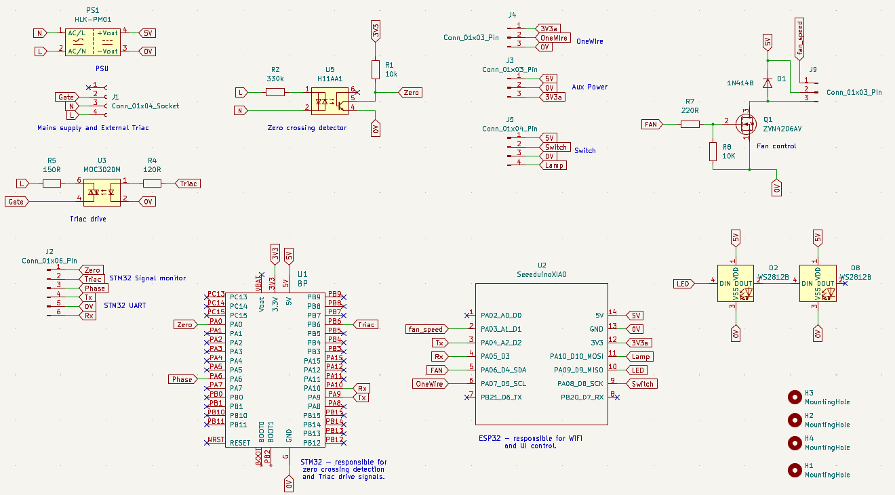

*schematic*

The PCB layout was done using [KiCad](https://www.kicad.org/).
The files are in [github](kicad/mains-power-control/).
The PCB looks like this :

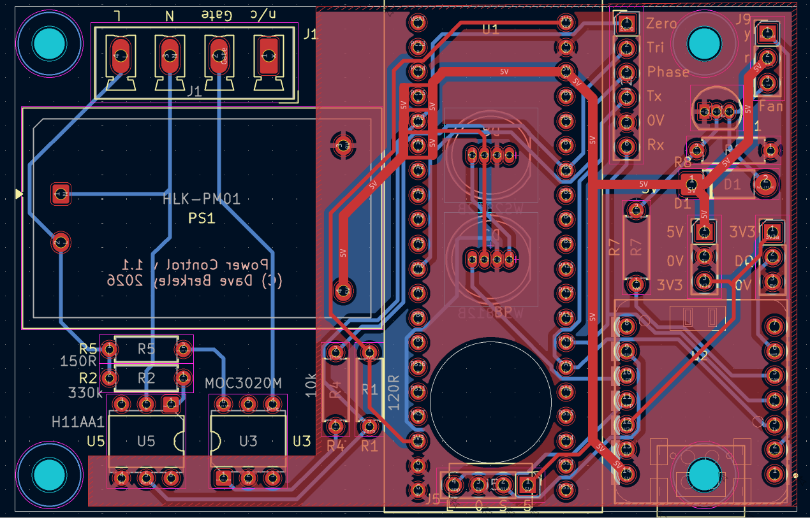

*PCB layout*

In version 1.1 of the board I placed the LEDs and switch housing on the PCB itself, 
rather than have a flying lead.
I added a FET switch to control the fan and a OneWire interface for the temperature sensor.
I left the test points for the STM32.
The XIAO ESP32C3 has an antenna socket. The simple ESP32C3 supermini boards do not
and this can limit the WiFi reception. 
There is also a ESP32C3 supermini plus that has an antenna socket.
I've been using this for other projects.

The circuit is missing a proper snubber circuit for the TRIACs.
The design would fail EMC regulations. I need to add this.

----

Enclosure
====

The enclosure design is written in 
[SCAD](https://openscad.org/).

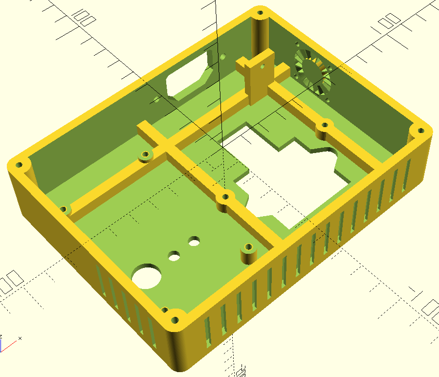

*enclosure CAD view*

The unit has an IEC power inlet, a UK style 13-Amp plug socket, the control PCB
connected to the switch and LEDs, the TRAIC mounted on a heatsink and a cooling fan.

There are air inlets on 2 sides, to allow the fan to produce a flow of air across the heatsink.
The inlets are designed with a kink in the path to prevent you from pushing things through them.

----
Temperature plots
====

I tried the unit with a 2kW electric heater. 
It is February and it has rained every day so far this year.
The sunshine was patchy with clouds frequently obscuring the sun.
I plotted the percent load and the temperature of the heatsink.
The x-axis is in seconds.

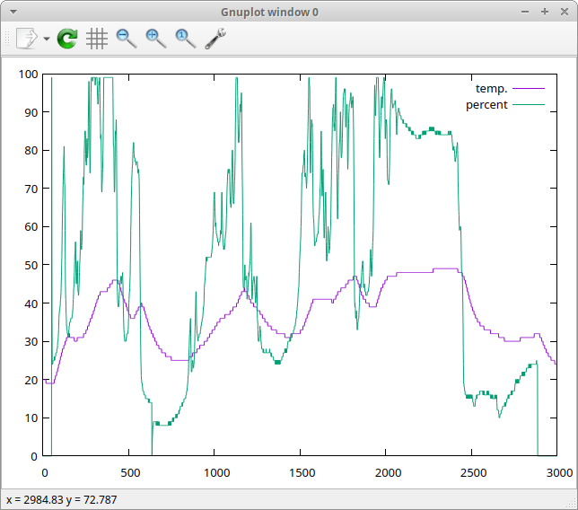

*temperatue plot*

You can see how the temperature rises when the load is supplied with more power.
It also cools when the percent power is reduced.
For a given ambient temperature the sensor temperature will stabilise
at a fixed temperature for a given power input.
It has to keep the TRIAC junction temperature below its maximum.
The case is made from PLA, a thermoplastic, so we also want to stop it from melting.
The PLA I'm using melts at 160C, but will soften before this.
The "Glass Transition Temperature" is 60C so we definitely want
to stay below this.

The fan control was set to come on at 27C.
Once the fan is running the heatsink will be able to dissipate more heat.
The TRIAC dissipates a Wattage in proportion to the current drawn through it by the load.
The device datasheet shows the relationship.
For a maximum current of around 10A we would expect the TRIAC to dissipate around 9W as heat.

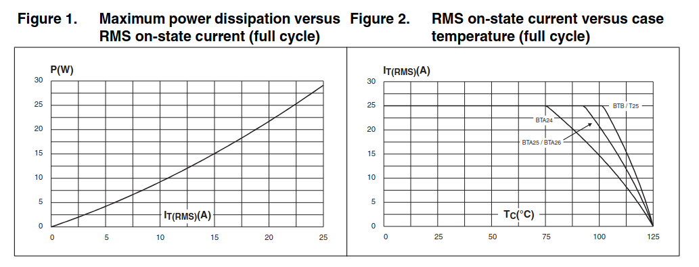

*TRIAC datasheet current vs. power dissipation*

This heat has to be removed to prevent the device junction temperature exceeding its max : 125C.
This is done by bolting the device to a heatsink.
This conducts heat away from the device and transfers it to the surrounding air.
This air cooling needed some assistance, so I added a fan set to direct a flow of air 
over the fins of the heatsink.
The temperature sensor is bolted to the heatsink.
It gives an indication of the device temperature.
If the sensor detects a temperature over the 'alarm' level the system goes into Error mode
and turns off power to the load until the sensor shows it has cooled down.

Here's another temperature / power plot showing that the fan provides quite 
good cooling allowing the temperature to be held between the fan on/off values
for low power levels.
The fan was cycling on and off to produce the 'W' shaped part of the waveform.
Once the power goes over a certain level, the fan is no longer able to cool the
heatsink below the fan-off threshold, so the temperature will 
stabilise at a higher level with the fan constantly on.

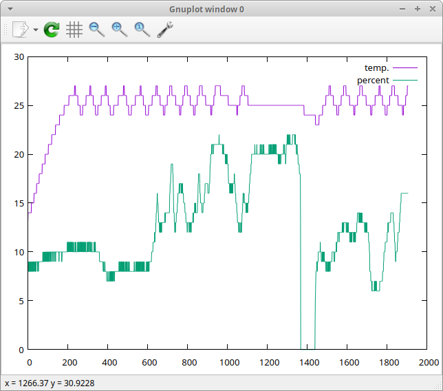

*temperature plot*

----

Lex
====

I use my 
[Lex](https://github.com/DaveBerkeley/lex)
utility to parse log files.
lex.py has a filter designed to work with my [Panglos][Panglos] logs.
This allows me to extract data directly from debug logs.
For example, to extract the temperature sensor readings live :

    echo -e "verbose app 1\nlog\n" | nc pwr1.local 6668  | lex.py -M panglos -m "te:=' t=(-?\d+)'" -f "%(te)s"

The first part 'echo -e "verbose app 1\nlog\n" | nc pwr1.local 6668' logs into the network CLI
of the device and sets verbose mode for the app. It then enables logging to the network CLI.
The output is piped into lex.py

Lex loads the [Panglos][Panglos] handler, 
which knows about the format of panglos logs,
extracts the temperature reading from the log and outputs it.
A single debug log line looks like this :

    320251 main DEBUG src/mains_control.cpp +480 set_phase() : phase=0 percent=0 power=188 t=17

The *-m* matches the " t=17" part and puts it into the variable 'te'.
The *-f* format line prints the temperature variable to stdout.
As all my projects use the same logging syntax and all my ESP32 projects have a net CLI
I can extract any data I need very easily from any project.

You can put lex commnds in a defaults file and load it, 
for example to default to panglos logs. Just add them to *~/.lexrc*

You can, for example, match on certain functions, or NOT those functions :

    lex.py -D -m "fn!='set_phase'"

will only print log lines that aren't from the trace above.
You can use logical operators to chains these matches together.

In my career I've seen lots of ad-hoc logging systems in companies I've worked for.
None has been as capable as my Panglos system.
With the lex.py tools you can extract any information you want from the logs.
For one company I worked for I used it to create a 
[dot](https://www.graphviz.org/doc/info/lang.html)
diagram of all the zeromq broker connections in a live system.
This immeadiately spotted some resource leaks.
It also gave a clear graph of the system interconnections which made it easier to develop the code 
and spot any errors.
I've also used it to create web pages of log traces where you can click on the log line
and it opens the source file in vim and takes you to the line that produced the log.
Logging can be very powerful. But you need the right tools.

I often pipe these lex outputs into a real-time graph using 
[cli-plot](https://www.npmjs.com/package/cli-plot).

----

Summary
====

I enjoyed making this device.
It is a horrible compromise fusion of STM32 and ESP32 because of limitations in the ESP32 SoC.
But it all came together very well.
The panglos libraries were easy to use. 
Each time I develop a project I end up adding to the libraries.
And each project becomes easier as the libraries already provide lots of functionality.

All I need now is some sunshine to power my heater and kettle.

Jan/Feb 2026

[Panglos]: https://github.com/DaveBerkeley/panglos 
[CLI library]: https://github.com/DaveBerkeley/cli

